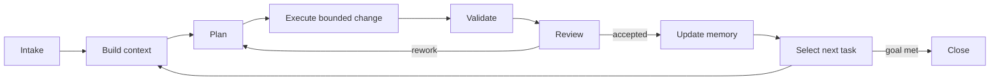

# Vectra — AI Project Operating System

**Version:** 0.1.0  
**Status:** Draft standard

Vectra is a model-independent way to run long-lived projects with AI agents. The project stores its goals, tasks, decisions, problems, evidence, and memory in versioned files, so work can continue after a chat ends or an agent is replaced.

Vectra is not a prompt library. A prompt starts the process; project artifacts and the loop govern what happens next.

## Quick start

Use Vectra files inside the project the agent will work on:

```text
your-project/
├── PROJECT.md       # goals, constraints, authority, Definition of Done
├── MEMORY.md        # verified current knowledge and recurring lessons
├── tasks/           # active and completed task records
└── decisions/       # durable decisions and trade-offs
```

### Existing project

Copy `templates/PROJECT.md` and `templates/MEMORY.md` into the repository, then give the agent this command:

```text
Adopt this existing project using Vectra 0.1.0.

Before asking me questions, inspect the repository: structure, documentation,
current implementation, Git history when available, tests, open problems, and
existing decisions. Do not change project files yet.

Summarize what you verified, what remains uncertain, and what appears risky.
Then interview me one question at a time to complete PROJECT.md. Use evidence
from the repository instead of asking me for facts you can discover yourself.
Prepare PROJECT.md and MEMORY.md for my review; do not treat them as approved
until I confirm them.
```

The agent MUST inspect the actual project before the owner interview. The interview fills only gaps that cannot be established safely from project evidence.

### New project

Start in an empty repository with this command:

```text
Initialize this new project using Vectra 0.1.0.

Interview me one question at a time about the outcome, users, non-goals,
constraints, risks, priorities, and approval boundaries. Offer concrete options
when useful. Then create PROJECT.md and an initial MEMORY.md from the Vectra
templates. Show me both files for approval before starting implementation.
After approval, create the first bounded TASK.md with measurable acceptance
criteria and execute it through the Vectra loop.
```

### Continue work in a new chat

```text
Resume this project under Vectra. Read PROJECT.md, MEMORY.md, active tasks,
applicable decisions, and current repository state. Identify the highest-priority
ready task, its current lifecycle state, the next permitted action, and required
validation. Continue only within recorded authority. Update task state and memory
before stopping.
```

## Project memory

Agents do not reliably remember earlier chats. Vectra gives the **project** durable memory:

- `PROJECT.md` stores the current goal, constraints, authority, and success measures.
- `TASK.md` records what was attempted, what changed, validation evidence, failures, and the next action.
- `DECISION.md` preserves important choices, rejected alternatives, and trade-offs.
- `MEMORY.md` stores verified facts, recurring problems, constraints, and lessons that remain useful.
- Git history preserves when and why these records changed.

An agent MUST update these artifacts after accepted work. It MUST distinguish verified facts from assumptions, keep provenance, mark superseded knowledge, and never use chat transcripts as the source of truth. A replacement agent should be able to resume using repository state alone.

## Operating loop



Every loop consumes explicit inputs, produces durable outputs, and has entry and exit criteria. See [VECTRA-002](docs/specs/VECTRA-002-workflow.md).

For the smallest useful adoption, start with [PROJECT.md](templates/PROJECT.md), [MEMORY.md](templates/MEMORY.md), and one [TASK.md](templates/TASK.md). Add other templates only when the project needs them. See the [adoption guide](docs/guides/adoption.md) for maturity levels.

## Specification index

| ID | Specification | Normative subject |
|---|---|---|
| 000 | [Manifest](docs/specs/VECTRA-000-manifest.md) | scope, philosophy, compatibility |
| 001 | [Constitution](docs/specs/VECTRA-001-constitution.md) | authority and non-negotiable rules |
| 002 | [Workflow](docs/specs/VECTRA-002-workflow.md) | iterative state machine |
| 003 | [Memory](docs/specs/VECTRA-003-memory.md) | external project memory |
| 004 | [Decisions](docs/specs/VECTRA-004-decisions.md) | decision records and trade-offs |
| 005 | [Agent Protocol](docs/specs/VECTRA-005-agent-protocol.md) | agent entry, operation, reporting, recovery |
| 006 | [Owner Protocol](docs/specs/VECTRA-006-owner-protocol.md) | human ownership and approvals |
| 007 | [Success Contracts](docs/specs/VECTRA-007-success-contracts.md) | acceptance and exit conditions |
| 008 | [Agent Roles](docs/specs/VECTRA-008-agent-roles.md) | bounded responsibilities |
| 009 | [Context Engineering](docs/specs/VECTRA-009-context-engineering.md) | deterministic context assembly |
| 010 | [Multi-Agent Collaboration](docs/specs/VECTRA-010-multi-agent-collaboration.md) | delegation and conflict handling |
| 011 | [Quality Assurance](docs/specs/VECTRA-011-quality-assurance.md) | evidence-based verification |
| 012 | [Knowledge Management](docs/specs/VECTRA-012-knowledge-management.md) | knowledge lifecycle and graph |
| 013 | [Prompt Interfaces](docs/specs/VECTRA-013-prompt-interfaces.md) | optional interaction adapters |
| 014 | [Best Practices](docs/specs/VECTRA-014-best-practices.md) | operational recommendations |

## Conformance

A project is **Vectra Core conformant** when it declares its Vectra version, assigns an owner, maintains project/task/memory/decision artifacts, uses explicit success contracts, performs validation before completion, and can resume from repository state without conversation history. Optional multi-agent and prompt-interface features do not affect Core conformance.

Normative words **MUST**, **MUST NOT**, **SHOULD**, **SHOULD NOT**, and **MAY** follow RFC 2119 meanings.

## Repository map

- `docs/specs/` — normative specifications.
- `docs/guides/` — adoption and migration guidance.
- `templates/` — controlled operational records.
- `examples/` — domain profiles showing concrete application.
- `diagrams/` — source Mermaid diagrams.
- `scripts/` — repository integrity checks.

## License

Documentation and templates are licensed under [CC BY 4.0](LICENSE).
