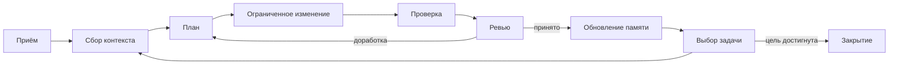

# Vectra — операционная система проекта для работы с AI

**Версия:** 0.1.0  
**Статус:** Черновик стандарта  
**Сайт:** <https://kitay-sudo.github.io/vectra/>

Vectra — независимый от модели способ вести долгие проекты вместе с AI-агентами. Проект хранит цели, задачи, решения, проблемы, свидетельства и память в версионируемых файлах, поэтому работа продолжается после того, как чат закончился или агента заменили.

Vectra — не библиотека промптов. Промпт запускает процесс; дальше происходящим управляют артефакты проекта и рабочий цикл.

## Установка одной командой

Команда приносит в проект **только рабочие документы**: контракт проекта, память, правила агента и шаблоны записей. Репозиторий не клонируется.

```sh
curl -fsSL https://raw.githubusercontent.com/kitay-sudo/vectra/main/install.sh | sh
```

Windows, PowerShell:

```powershell
irm https://raw.githubusercontent.com/kitay-sudo/vectra/main/install.ps1 | iex
```

После установки:

```text
ваш-проект/
├── AGENTS.md           # точка входа: агент читает её сам в новой сессии
├── CLAUDE.md           # то же для Claude Code (импортирует AGENTS.md)
├── PROJECT.md          # цели, ограничения, полномочия, критерии готовности
├── MEMORY.md           # проверенные знания и повторяющиеся уроки
├── tasks/              # записи активных и закрытых задач
├── decisions/          # устойчивые решения и компромиссы
└── vectra/
    ├── AGENTS.md       # полные правила агента: цикл, полномочия, приёмка
    ├── VERSION         # версия стандарта, по которой живёт проект
    └── templates/      # TASK.md, DECISION.md, STATUS.md
```

### Автозагрузка в новой сессии

Агенты сами читают один файл в корне проекта при старте: Claude Code — `CLAUDE.md`, Cursor / Codex / Zed и другие — `AGENTS.md`. Установщик кладёт туда точку входа Vectra, поэтому **в новой сессии достаточно описать задачу** — агент уже прочитает `vectra/AGENTS.md`, `PROJECT.md`, `MEMORY.md` и активные задачи и продолжит по стандарту. Отдельную команду вставлять не нужно.

Если агентский файл уже есть, установщик не перезаписывает его, а дописывает блок Vectra между маркерами `<!-- vectra:start -->` … `<!-- vectra:end -->`. Повторный запуск ничего не дублирует. Полные правила остаются в `vectra/AGENTS.md`, а корневой файл только направляет к ним.

### Что команда не тянет

Осознанное ограничение: в рабочий проект попадает то, чем в нём работают, а не то, что описывает сам стандарт.

| Не скачивается | Почему |
|---|---|
| `diagrams/` | иллюстрируют стандарт, не участвуют в работе |
| `site/` | лендинг проекта Vectra |
| `docs/specs/`, `docs/guides/` | норматив целиком; выжимка уже в `vectra/AGENTS.md` |
| `examples/` | доменные профили для чтения, а не для копирования |
| `.github/`, `scripts/` | CI и проверки самого репозитория |
| `CHANGELOG.md`, `ROADMAP.md`, `CONTRIBUTING.md` | история и правила разработки стандарта |

Существующие файлы не перезаписываются: если в проекте уже есть `PROJECT.md`, установщик его пропустит и сообщит об этом.

### Опции

Аргументы передаются после `-s --` для `sh` и напрямую для PowerShell.

```sh
curl -fsSL https://raw.githubusercontent.com/kitay-sudo/vectra/main/install.sh | sh -s -- --profile full --dir ./service
```

```powershell
& ([scriptblock]::Create((irm https://raw.githubusercontent.com/kitay-sudo/vectra/main/install.ps1))) -Profile full -Dir ./service
```

| Опция | Значение |
|---|---|
| `--profile core` | рабочий минимум: `PROJECT`, `MEMORY`, `TASK`, `DECISION`, `STATUS`, `AGENTS`. По умолчанию |
| `--profile full` | плюс условные шаблоны: вопросы, риски, ретроспективы, баг-репорты и остальные |
| `--dir <путь>` | каталог проекта, по умолчанию текущий |
| `--ref <ref>` | тег, ветка или коммит стандарта, по умолчанию `main` |
| `--force` | перезаписывать существующие файлы |

Состав каждого профиля задаётся одним файлом — [install/manifest.txt](install/manifest.txt). Его читают оба установщика и проверка целостности репозитория, поэтому расхождение между документацией и реальной установкой невозможно.

Чтобы закрепить версию стандарта, укажите тег: `--ref v0.1.0`.

## Быстрый старт

После установки правила Vectra уже подхватываются автоматически, поэтому в новой сессии можно просто описать задачу. Готовые команды ниже — для трёх типовых сценариев; строка «Прочитай vectra/AGENTS.md» в них лишь дублирует автозагрузку и ничему не мешает.

### Существующий проект

Установите файлы и дайте агенту команду:

```text
Подключи этот проект к Vectra 0.1.0. Прочитай vectra/AGENTS.md.

До вопросов изучи репозиторий: структуру, документацию, текущую реализацию,
историю Git, тесты, открытые проблемы и принятые решения. Пока ничего не меняй.

Опиши, что ты проверил, что осталось неизвестным и что выглядит рискованным.
Затем задавай мне по одному вопросу, чтобы заполнить PROJECT.md. Опирайся на
свидетельства из репозитория вместо вопросов о том, что можешь узнать сам.
Подготовь PROJECT.md и MEMORY.md на моё рассмотрение; не считай их
утверждёнными, пока я не подтвержу.
```

Агент ОБЯЗАН изучить проект до интервью с владельцем. Интервью закрывает только те пробелы, которые нельзя безопасно установить по свидетельствам репозитория.

### Новый проект

```text
Создай новый проект по Vectra 0.1.0. Прочитай vectra/AGENTS.md.

Проведи интервью по одному вопросу за раз: результат, пользователи, антицели,
ограничения, риски, приоритеты и границы полномочий. Предлагай конкретные
варианты, когда это уместно. Затем создай PROJECT.md и начальный MEMORY.md
из шаблонов Vectra. Покажи оба файла на утверждение до начала реализации.
После утверждения заведи первую ограниченную задачу tasks/TASK-001.md
с измеримыми критериями приёмки и выполни её по циклу Vectra.
```

### Продолжение в новом чате

```text
Продолжи этот проект по Vectra. Прочитай vectra/AGENTS.md, PROJECT.md,
MEMORY.md, активные задачи, применимые решения и текущее состояние
репозитория. Определи приоритетную готовую задачу, её состояние жизненного
цикла, следующее разрешённое действие и требуемую проверку. Продолжай только
в рамках записанных полномочий. Перед остановкой обнови состояние задачи
и память.
```

## Память проекта

Агенты не помнят прошлые чаты надёжно. Vectra даёт устойчивую память **проекту**:

- `PROJECT.md` хранит текущую цель, ограничения, полномочия и меры успеха.
- `TASK.md` фиксирует, что было предпринято, что изменилось, какие свидетельства собраны, что отказало и каким будет следующее действие.
- `DECISION.md` сохраняет важные выборы, отвергнутые альтернативы и компромиссы.
- `MEMORY.md` хранит проверенные факты, повторяющиеся проблемы, ограничения и уроки, которые остаются полезными.
- История Git сохраняет, когда и почему эти записи менялись.

Агент ОБЯЗАН обновлять эти артефакты после принятой работы. Он ОБЯЗАН отличать проверенные факты от допущений, хранить происхождение знания, помечать замещённое и никогда не использовать переписку как источник правды. Замещающий агент должен продолжить работу, имея только состояние репозитория.

## Рабочий цикл



Каждая итерация потребляет явные входы, производит устойчивые выходы и имеет условия входа и выхода. См. [VECTRA-002](docs/specs/VECTRA-002-workflow.md).

Минимальное полезное внедрение — [PROJECT.md](templates/PROJECT.md), [MEMORY.md](templates/MEMORY.md), [AGENTS.md](templates/AGENTS.md) и одна [TASK.md](templates/TASK.md). Остальные шаблоны добавляйте, когда проект в них упрётся. Уровни зрелости описаны в [руководстве по внедрению](docs/guides/adoption.md).

## Индекс спецификаций

| ID | Спецификация | Предмет нормирования |
|---|---|---|
| 000 | [Манифест](docs/specs/VECTRA-000-manifest.md) | границы, философия, совместимость |
| 001 | [Конституция](docs/specs/VECTRA-001-constitution.md) | полномочия и правила без исключений |
| 002 | [Рабочий цикл](docs/specs/VECTRA-002-workflow.md) | итеративный конечный автомат |
| 003 | [Память](docs/specs/VECTRA-003-memory.md) | внешняя память проекта |
| 004 | [Решения](docs/specs/VECTRA-004-decisions.md) | записи решений и компромиссы |
| 005 | [Протокол агента](docs/specs/VECTRA-005-agent-protocol.md) | вход, работа, отчётность, восстановление |
| 006 | [Протокол владельца](docs/specs/VECTRA-006-owner-protocol.md) | владение и подтверждения |
| 007 | [Контракты успеха](docs/specs/VECTRA-007-success-contracts.md) | приёмка и условия выхода |
| 008 | [Роли агентов](docs/specs/VECTRA-008-agent-roles.md) | ограниченные зоны ответственности |
| 009 | [Инженерия контекста](docs/specs/VECTRA-009-context-engineering.md) | детерминированная сборка контекста |
| 010 | [Взаимодействие агентов](docs/specs/VECTRA-010-multi-agent-collaboration.md) | делегирование и разрешение конфликтов |
| 011 | [Обеспечение качества](docs/specs/VECTRA-011-quality-assurance.md) | проверка на свидетельствах |
| 012 | [Управление знаниями](docs/specs/VECTRA-012-knowledge-management.md) | жизненный цикл знания и граф |
| 013 | [Промпт-интерфейсы](docs/specs/VECTRA-013-prompt-interfaces.md) | опциональные адаптеры взаимодействия |
| 014 | [Лучшие практики](docs/specs/VECTRA-014-best-practices.md) | операционные рекомендации |

## Соответствие

Проект **соответствует ядру Vectra**, когда он объявляет версию Vectra, назначает владельца, ведёт артефакты проекта, задач, памяти и решений, использует явные контракты успеха, выполняет проверку до завершения работы и может продолжиться из состояния репозитория без истории переписки. Опциональные возможности — мультиагентность и промпт-интерфейсы — на соответствие ядру не влияют.

Нормативные слова **ОБЯЗАН**, **ЗАПРЕЩЕНО**, **СЛЕДУЕТ**, **НЕ СЛЕДУЕТ** и **МОЖЕТ** имеют значения из RFC 2119.

## Карта репозитория

- `docs/specs/` — нормативные спецификации.
- `docs/guides/` — внедрение и миграция.
- `templates/` — управляемые операционные записи.
- `install/` — манифест установки рабочих документов.
- `examples/` — доменные профили с конкретным применением.
- `diagrams/` — исходные диаграммы Mermaid.
- `scripts/` — проверки целостности репозитория.
- `site/` — исходники лендинга.

## Лицензия

Документация и шаблоны распространяются по лицензии [CC BY 4.0](LICENSE).
