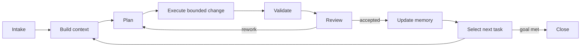

# Vectra — AI Project Operating System

**Version:** 0.1.0  
**Status:** Draft standard

Vectra is a model-independent operating protocol for projects executed by humans and AI agents. It keeps authority, state, decisions, evidence, and memory in versioned project artifacts so that work survives context loss and agent replacement.

Vectra is not a prompt library. Prompts may start an interaction; the Vectra loop governs the work.

## Operating loop

Every loop consumes explicit inputs, produces durable outputs, and has entry and exit criteria. See [VECTRA-002](docs/specs/VECTRA-002-workflow.md).

## Start here

1. Adopt the [manifest](docs/specs/VECTRA-000-manifest.md) and [constitution](docs/specs/VECTRA-001-constitution.md).
2. Copy [PROJECT.md](templates/PROJECT.md), [MEMORY.md](templates/MEMORY.md), and [TASK.md](templates/TASK.md) into the project.
3. Define acceptance evidence using [VECTRA-007](docs/specs/VECTRA-007-success-contracts.md).
4. Run the loop in [VECTRA-002](docs/specs/VECTRA-002-workflow.md).
5. Record durable decisions and learnings; never rely on chat history as the system of record.

## Specification index

| ID | Specification | Normative subject |
|---|---|---|
| 000 | [Manifest](docs/specs/VECTRA-000-manifest.md) | scope, philosophy, compatibility |
| 001 | [Constitution](docs/specs/VECTRA-001-constitution.md) | authority and non-negotiable rules |
| 002 | [Workflow](docs/specs/VECTRA-002-workflow.md) | iterative state machine |
| 003 | [Memory](docs/specs/VECTRA-003-memory.md) | external project memory |
| 004 | [Decisions](docs/specs/VECTRA-004-decisions.md) | decision records and trade-offs |
| 005 | [Agent Protocol](docs/specs/VECTRA-005-agent-protocol.md) | agent entry, operation, reporting, recovery |
| 006 | [Owner Protocol](docs/specs/VECTRA-006-owner-protocol.md) | human ownership and approvals |
| 007 | [Success Contracts](docs/specs/VECTRA-007-success-contracts.md) | acceptance and exit conditions |
| 008 | [Agent Roles](docs/specs/VECTRA-008-agent-roles.md) | bounded responsibilities |
| 009 | [Context Engineering](docs/specs/VECTRA-009-context-engineering.md) | deterministic context assembly |
| 010 | [Multi-Agent Collaboration](docs/specs/VECTRA-010-multi-agent-collaboration.md) | delegation and conflict handling |
| 011 | [Quality Assurance](docs/specs/VECTRA-011-quality-assurance.md) | evidence-based verification |
| 012 | [Knowledge Management](docs/specs/VECTRA-012-knowledge-management.md) | knowledge lifecycle and graph |
| 013 | [Prompt Interfaces](docs/specs/VECTRA-013-prompt-interfaces.md) | optional interaction adapters |
| 014 | [Best Practices](docs/specs/VECTRA-014-best-practices.md) | operational recommendations |

## Conformance

A project is **Vectra Core conformant** when it declares its Vectra version, assigns an owner, maintains project/task/memory/decision artifacts, uses explicit success contracts, performs validation before completion, and can resume from repository state without conversation history. Optional multi-agent and prompt-interface features do not affect Core conformance.

Normative words **MUST**, **MUST NOT**, **SHOULD**, **SHOULD NOT**, and **MAY** follow RFC 2119 meanings.

## Repository map

- `docs/specs/` — normative specifications.
- `docs/guides/` — adoption and migration guidance.
- `templates/` — controlled operational records.
- `examples/` — domain profiles showing concrete application.
- `diagrams/` — source Mermaid diagrams.
- `scripts/` — repository integrity checks.

## License

Documentation and templates are licensed under [CC BY 4.0](LICENSE).
