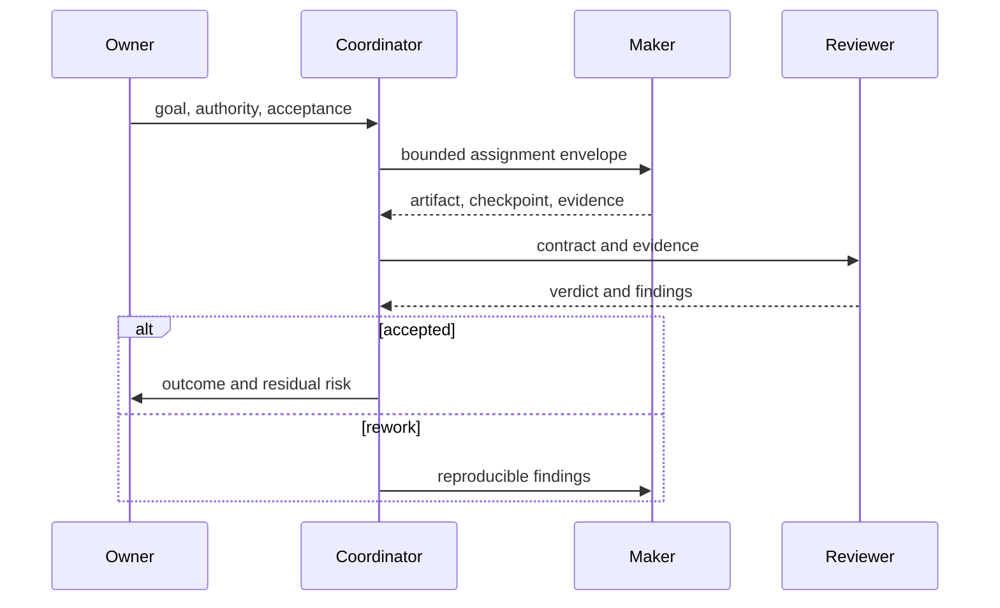

# Agent interaction

```mermaid
sequenceDiagram
  participant O as Owner
  participant C as Coordinator
  participant M as Maker
  participant R as Reviewer
  O->>C: goal, authority, acceptance
  C->>M: bounded assignment envelope
  M-->>C: artifact, checkpoint, evidence
  C->>R: contract and evidence
  R-->>C: verdict and findings
  alt accepted
    C->>O: outcome and residual risk
  else rework
    C->>M: reproducible findings
  end
```
