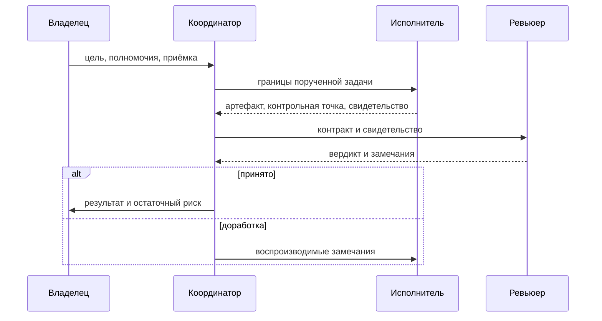

# Взаимодействие агентов

```mermaid
sequenceDiagram
  participant O as Владелец
  participant C as Координатор
  participant M as Исполнитель
  participant R as Ревьюер
  O->>C: цель, полномочия, приёмка
  C->>M: границы порученной задачи
  M-->>C: артефакт, контрольная точка, свидетельство
  C->>R: контракт и свидетельство
  R-->>C: вердикт и замечания
  alt принято
    C->>O: результат и остаточный риск
  else доработка
    C->>M: воспроизводимые замечания
  end
```
