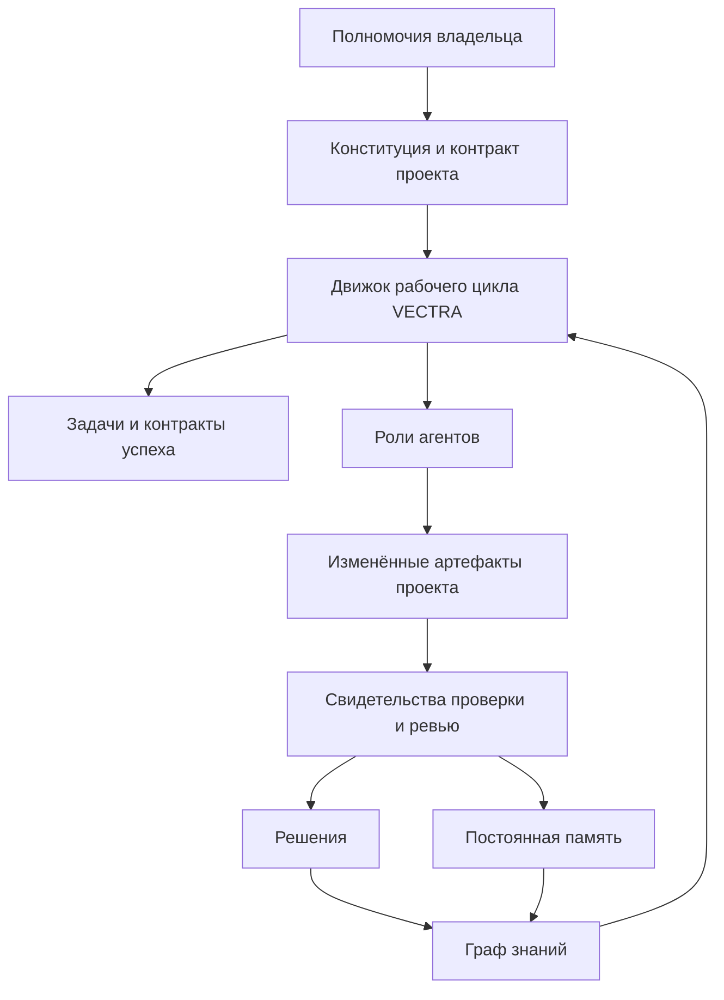

# Архитектура

```mermaid
flowchart TB
  O["Полномочия владельца"] --> C["Конституция и контракт проекта"]
  C --> W["Движок рабочего цикла VECTRA"]
  W --> T["Задачи и контракты успеха"]
  W --> A["Роли агентов"]
  A --> X["Изменённые артефакты проекта"]
  X --> Q["Свидетельства проверки и ревью"]
  Q --> D["Решения"]
  Q --> M["Постоянная память"]
  D --> K["Граф знаний"]
  M --> K
  K --> W
```
