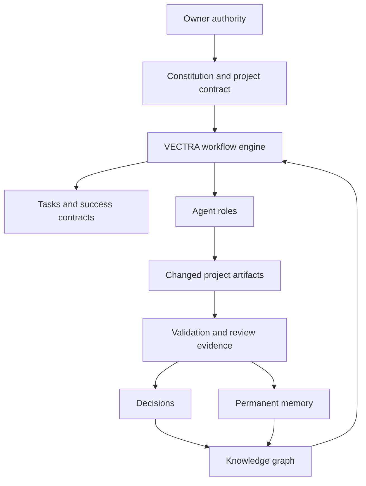

# Architecture

```mermaid
flowchart TB
  O["Owner authority"] --> C["Constitution and project contract"]
  C --> W["VECTRA workflow engine"]
  W --> T["Tasks and success contracts"]
  W --> A["Agent roles"]
  A --> X["Changed project artifacts"]
  X --> Q["Validation and review evidence"]
  Q --> D["Decisions"]
  Q --> M["Permanent memory"]
  D --> K["Knowledge graph"]
  M --> K
  K --> W
```
