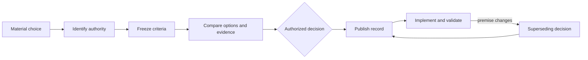

# Decision flow

```mermaid
flowchart LR
  T["Material choice"] --> A["Identify authority"]
  A --> K["Freeze criteria"]
  K --> O["Compare options and evidence"]
  O --> D{"Authorized decision"}
  D --> R["Publish record"]
  R --> I["Implement and validate"]
  I -->|premise changes| S["Superseding decision"]
  S --> R
```
