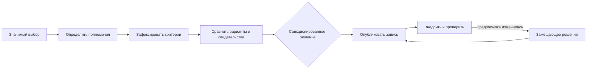

# Поток решений

```mermaid
flowchart LR
  T["Значимый выбор"] --> A["Определить полномочия"]
  A --> K["Зафиксировать критерии"]
  K --> O["Сравнить варианты и свидетельства"]
  O --> D{"Санкционированное решение"}
  D --> R["Опубликовать запись"]
  R --> I["Внедрить и проверить"]
  I -->|предпосылка изменилась| S["Замещающее решение"]
  S --> R
```
