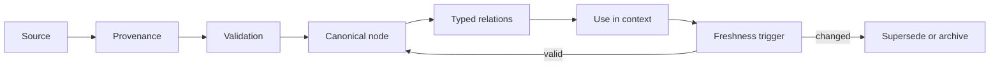

# Knowledge flow

```mermaid
flowchart LR
  S["Source"] --> P["Provenance"]
  P --> V["Validation"]
  V --> N["Canonical node"]
  N --> L["Typed relations"]
  L --> U["Use in context"]
  U --> F["Freshness trigger"]
  F -->|valid| N
  F -->|changed| X["Supersede or archive"]
```
