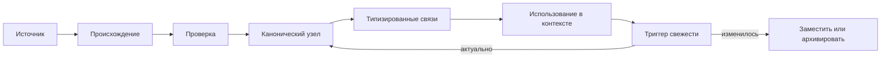

# Поток знаний

```mermaid
flowchart LR
  S["Источник"] --> P["Происхождение"]
  P --> V["Проверка"]
  V --> N["Канонический узел"]
  N --> L["Типизированные связи"]
  L --> U["Использование в контексте"]
  U --> F["Триггер свежести"]
  F -->|актуально| N
  F -->|изменилось| X["Заместить или архивировать"]
```
