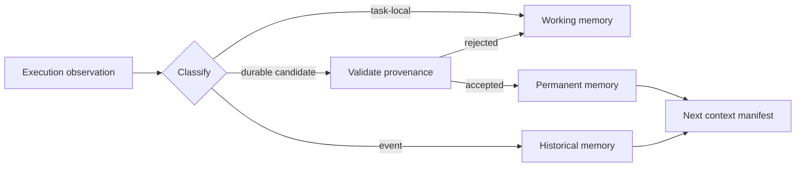

# Memory flow

```mermaid
flowchart LR
  E["Execution observation"] --> C{"Classify"}
  C -->|task-local| W["Working memory"]
  C -->|durable candidate| V["Validate provenance"]
  C -->|event| H["Historical memory"]
  V -->|accepted| P["Permanent memory"]
  V -->|rejected| W
  P --> X["Next context manifest"]
  H --> X
```
