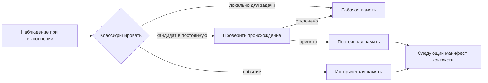

# Поток памяти

```mermaid
flowchart LR
  E["Наблюдение при выполнении"] --> C{"Классифицировать"}
  C -->|локально для задачи| W["Рабочая память"]
  C -->|кандидат в постоянную| V["Проверить происхождение"]
  C -->|событие| H["Историческая память"]
  V -->|принято| P["Постоянная память"]
  V -->|отклонено| W
  P --> X["Следующий манифест контекста"]
  H --> X
```
