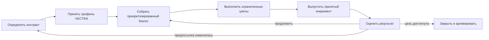

# Жизненный цикл проекта

```mermaid
flowchart LR
  D["Определить контракт"] --> A["Принять профиль VECTRA"]
  A --> B["Собрать приоритизированный бэклог"]
  B --> L["Выполнять ограниченные циклы"]
  L --> R["Выпустить принятый инкремент"]
  R --> E["Оценить результат"]
  E -->|продолжить| B
  E -->|цель достигнута| C["Закрыть и архивировать"]
  E -->|предпосылка изменилась| D
```
