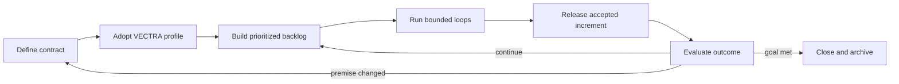

# Project lifecycle

```mermaid
flowchart LR
  D["Define contract"] --> A["Adopt VECTRA profile"]
  A --> B["Build prioritized backlog"]
  B --> L["Run bounded loops"]
  L --> R["Release accepted increment"]
  R --> E["Evaluate outcome"]
  E -->|continue| B
  E -->|goal met| C["Close and archive"]
  E -->|premise changed| D
```
