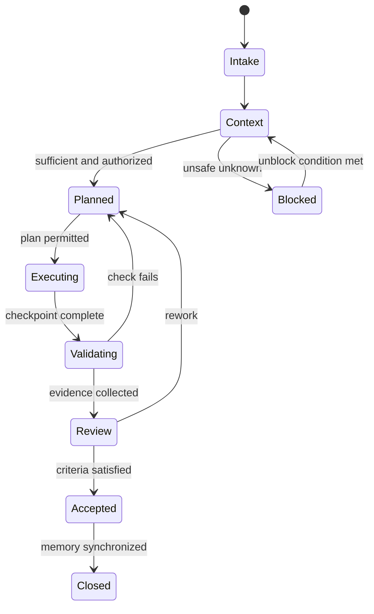

# Workflow

```mermaid
stateDiagram-v2
  [*] --> Intake
  Intake --> Context
  Context --> Planned: sufficient and authorized
  Context --> Blocked: unsafe unknown
  Planned --> Executing: plan permitted
  Executing --> Validating: checkpoint complete
  Validating --> Review: evidence collected
  Validating --> Planned: check fails
  Review --> Planned: rework
  Review --> Accepted: criteria satisfied
  Accepted --> Closed: memory synchronized
  Blocked --> Context: unblock condition met
```
