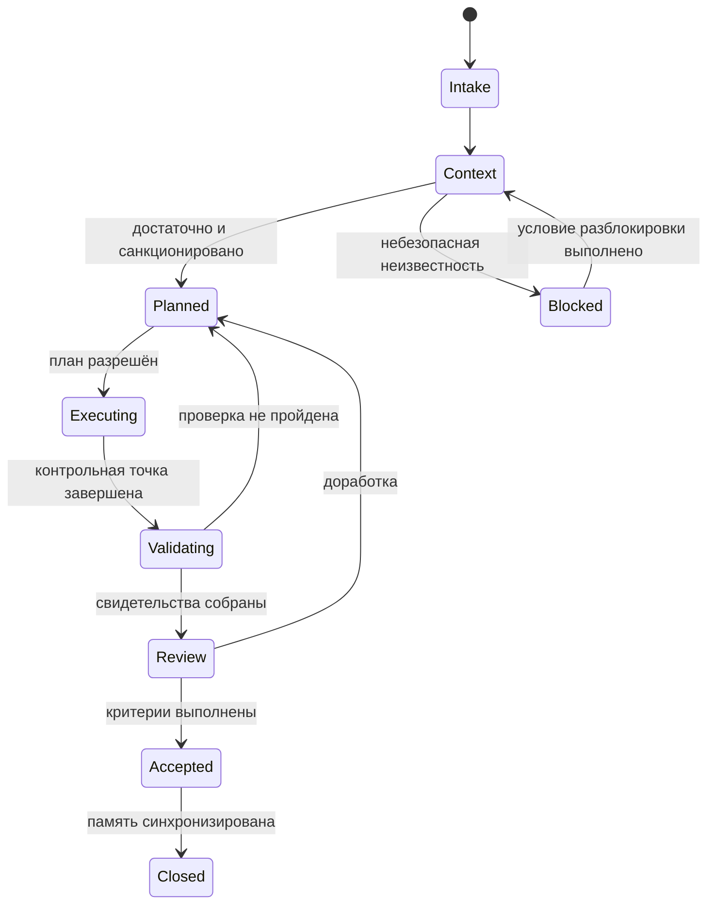

# Рабочий цикл

```mermaid
stateDiagram-v2
  [*] --> Intake
  Intake --> Context
  Context --> Planned: достаточно и санкционировано
  Context --> Blocked: небезопасная неизвестность
  Planned --> Executing: план разрешён
  Executing --> Validating: контрольная точка завершена
  Validating --> Review: свидетельства собраны
  Validating --> Planned: проверка не пройдена
  Review --> Planned: доработка
  Review --> Accepted: критерии выполнены
  Accepted --> Closed: память синхронизирована
  Blocked --> Context: условие разблокировки выполнено
```
